# Sitemap

## Route Map

```mermaid
graph TD
    subgraph "Personal Finance Tracker"
        A["/"] --> HOME["🏠 Home"]
        B["/history"] --> HISTORY["📜 History"]
        C["/history/:id"] --> DETAIL["📄 Detail"]
        D["/history/:id/edit"] --> EDIT["✏️ Edit"]
        E["/add"] --> ADD["➕ Add"]
        F["/budgets"] --> BUDGETS["🎯 Budgets"]
        G["/settings"] --> SETTINGS["⚙️ Settings"]
    end

    HOME --> B
    HOME --> E
    HOME --> F
    HOME --> G
    HISTORY --> C
    C --> D
```

## Pages

| Route | Page | Description |
|-------|------|-------------|
| `/` | **Home** | Dashboard with greeting, stats, budget alerts, AI insights |
| `/history` | **History** | Searchable expense list grouped by month |
| `/history/:id` | **Detail** | View expense with receipt |
| `/history/:id/edit` | **Edit** | Modify expense |
| `/add` | **Add** | AI chat or manual form entry |
| `/budgets` | **Budgets** | Set monthly limits per category |
| `/settings` | **Settings** | API keys, S3 backup, categories |

## Navigation

**BottomNav** (floating pill bar):
- 🏠 Home → `/`
- 📜 History → `/history`
- ➕ Add → `/add` (center)
- 🎯 Budgets → `/budgets`
- ⚙️ Settings → `/settings`
